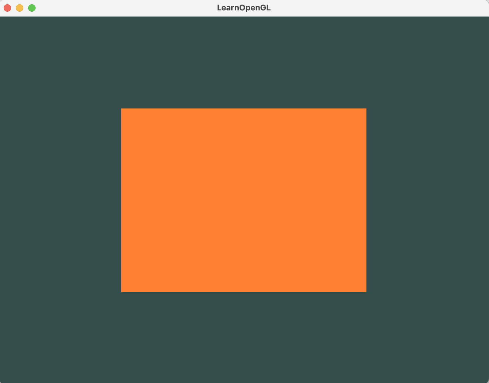

[搭建参考](https://blog.csdn.net/suchvaliant/article/details/122747967?ops_request_misc=%257B%2522request%255Fid%2522%253A%2522169984347216800184166715%2522%252C%2522scm%2522%253A%252220140713.130102334.pc%255Fall.%2522%257D&request_id=169984347216800184166715&biz_id=0&utm_medium=distribute.pc_search_result.none-task-blog-2~all~first_rank_ecpm_v1~rank_v31_ecpm-1-122747967-null-null.142^v96^pc_search_result_base1&utm_term=glfw%20mac%20vscode%20%E6%90%AD%E5%BB%BA&spm=1018.2226.3001.4187)

# 环境依赖
## 1.安装glfw
brew install glfw

根据glfw版本安装 修改 CMakeLists.txt中glfw版本号
## 2.配置cmake环境变量
作者用的是android sdk环境下的cmake

vim ~/.zshrc

export PATH=$PATH:$ANDROID_HOME/cmake/3.22.1/bin

source ~/.zshrc 

# 编译运行命令：
cmake .

make

./test

运行结果

